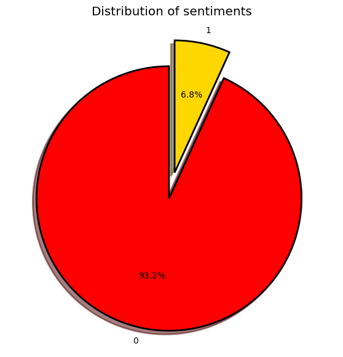

```python
# This Section is Used to Import some Essential Libraries for our Project 
# Few Libraries are built-in and few are third party which are imported online  


import pandas as pd
# Pandas It provides data structures and data analysis tools for handling and manipulating numerical tables and time series data.


import numpy as np
# Numpy provides support for large, multi-dimensional arrays and matrices of numerical data, as well as a collection of mathematical functions to operate on these arrays.


import re
# re (Regular Expression ) provides functions for searching and manipulating strings using regular expressions, which are a powerful tool for pattern matching and text processing


import seaborn as sns
# seaborn provides a high-level interface for creating attractive and informative statistical graphics. Seaborn is particularly well suited for visualizing complex datasets with multiple variables.

import matplotlib.pyplot as plt
#Matplotlib provides a wide variety of plotting options including line plots, scatter plots, bar plots, histograms, 3D plots, and more. 
import matplotlib.pyplot as plt
from matplotlib import style
style.use('ggplot')
#preprocessing


from nltk.tokenize import word_tokenize
from nltk.stem import WordNetLemmatizer
from nltk.corpus import stopwords


import nltk
# The Natural Language Toolkit (nltk) is a python library for working with human language data.
# It provides tools to work with a wide range of text-based data, including tokenization, stemming, and part-of-speech tagging,
# as well as tools for processing and analyzing linguistic structure, such as parsing and semantic reasoning.


nltk.download('stopwords')
stop_words = set(stopwords.words('english'))
#model building

from wordcloud import WordCloud
# A word cloud is created using a word frequency analysis, in which the number of times each word appears in a text is counted.
# The resulting data is then used to generate a visualization in which the most frequently used words appear larger and more prominent.


from sklearn.feature_extraction.text import TfidfVectorizer
# Scikit-learn (sklearn) provides a wide range of tools for tasks such as classification, regression, clustering, dimensionality reduction, and model selection.


from sklearn.model_selection import train_test_split
from sklearn.linear_model import LogisticRegression
from sklearn.metrics import accuracy_score, classification_report, confusion_matrix, ConfusionMatrixDisplay
```

    [nltk_data] Downloading package stopwords to C:\Users\Anurag
    [nltk_data]     Dandge\AppData\Roaming\nltk_data...
    [nltk_data]   Package stopwords is already up-to-date!
    


```python
# In This Section we are Printing some data from our Data Set which contains Twitter Tweets the ( raw data )  
tweet_df = pd.read_csv('train.csv')
tweet_df.head()
tweet_df.info()
print()
print("printing random tweets : ")
print()
print(tweet_df['tweet'].iloc[0],"\n")
print(tweet_df['tweet'].iloc[1],"\n")
print(tweet_df['tweet'].iloc[2],"\n")
print(tweet_df['tweet'].iloc[14],"\n")
print(tweet_df['tweet'].iloc[15],"\n")

```

    <class 'pandas.core.frame.DataFrame'>
    RangeIndex: 31962 entries, 0 to 31961
    Data columns (total 3 columns):
     #   Column  Non-Null Count  Dtype 
    ---  ------  --------------  ----- 
     0   id      31962 non-null  int64 
     1   label   31962 non-null  int64 
     2   tweet   31962 non-null  object
    dtypes: int64(2), object(1)
    memory usage: 749.2+ KB
    
    printing random tweets : 
    
     @user when a father is dysfunctional and is so selfish he drags his kids into his dysfunction.   #run 
    
    @user @user thanks for #lyft credit i can't use cause they don't offer wheelchair vans in pdx.    #disapointed #getthanked 
    
      bihday your majesty 
    
    no comment!  in #australia   #opkillingbay #seashepherd #helpcovedolphins #thecove  #helpcovedolphins 
    
    ouch...junior is angry😐#got7 #junior #yugyoem   #omg  
    
    


```python
def data_processing(tweet):
    tweet = tweet.lower() # Converting All tweets to Lower Case 
    tweet = re.sub(r"https\S+|www\S+http\S+", '', tweet, flags = re.MULTILINE)
    tweet = re.sub(r'\@w+|\#','', tweet)
    tweet = re.sub(r'[^\w\s]','',tweet)
    tweet = re.sub(r'ð','',tweet)
    tweet_tokens = word_tokenize(tweet) 
    # Above line will seperate the tweets into the words Ex. -> 
    #"This is an example sentence." to ['This', 'is', 'an', 'example', 'sentence', '.']
    filtered_tweets = [w for w in tweet_tokens if not w in stop_words]
    return " ".join(filtered_tweets)


# In the Above Function we Are Processing our Data with the help of 're' (Regular Expression ) Modeule 
# `re` provides functions for searching, splitting, and replacing strings based on the patterns.
# It will replace all the unwanted data like 'https,www,http ' these with blank space 


tweet_df.tweet = tweet_df['tweet'].apply(data_processing)
tweet_df = tweet_df.drop_duplicates('tweet')


from nltk.stem import WordNetLemmatizer
# A word lemmatizer is a tool that reduces a word to its base or root form.
# The base form, or lemma, is the form of the word that is used to represent all of its inflected forms.
# For example, the lemma of the word "running" might be "run".

lemmatizer = WordNetLemmatizer()
def lemmatizing(data):
    tweet = [lemmatizer.lemmatize(word) for word in data]
    return data


import nltk

nltk.download('wordnet')
tweet_df['tweet'] = tweet_df['tweet'].apply(lambda x: lemmatizing(x))

print("printing the data to see the effect of preprocessing : ")
print()
print(tweet_df['tweet'].iloc[0],"\n")
print(tweet_df['tweet'].iloc[1],"\n")
print(tweet_df['tweet'].iloc[2],"\n")
print(tweet_df['tweet'].iloc[14],"\n")
print(tweet_df['tweet'].iloc[15],"\n")

#  In the above code we are printing Processed data which is filtered , we've removed unwanted data like "http , www, https , # , @ "
#  So it will help us to perform oprations on our data seemlesly 

tweet_df['label'].value_counts() 

#  In the above code we are also printing the count of labeles which are in the form of 1 & 0 ,
# 0's represents  for Normal speech or tweets and 1's represents for the Hateful Tweets 

```


    ---------------------------------------------------------------------------

    NameError                                 Traceback (most recent call last)

    ~\AppData\Local\Temp\ipykernel_4532\3860984972.py in <module>
         19 
         20 
    ---> 21 tweet_df.tweet = tweet_df['tweet'].apply(data_processing)
         22 tweet_df = tweet_df.drop_duplicates('tweet')
         23 
    

    NameError: name 'tweet_df' is not defined


```python

fig = plt.figure(figsize=(5,5)) 
sns.countplot(x='label', data = tweet_df)

#  Here, we are Visualizing our data in the form of of bar graph 

```


    <AxesSubplot:xlabel='label', ylabel='count'>


    

    


```python

fig = plt.figure(figsize=(7,7))
colors = ("red", "gold")
wp = {'linewidth':2, 'edgecolor':"black"}
tags = tweet_df['label'].value_counts()
explode = (0.1, 0.1)
tags.plot(kind='pie',autopct = '%1.1f%%', shadow=True, colors = colors, startangle =90, 
         wedgeprops = wp, explode = explode, label='')

plt.title('Distribution of sentiments')

#  Here , we are Visualizing the data in the form of Pie Chart whcih denote the percentage of the hateful tweets and normal tweets 
```


    Text(0.5, 1.0, 'Distribution of sentiments')


    

    


```python

print("normal speach tweets : ")
non_hate_tweets = tweet_df[tweet_df.label == 0]
non_hate_tweets.head()

# Here we are pritng the processed tweets which are labeled as '0' means which are normal tweets in the form of table 
```

    normal speach tweets : 
    


<div>
<style scoped>
    .dataframe tbody tr th:only-of-type {
        vertical-align: middle;
    }

    .dataframe tbody tr th {
        vertical-align: top;
    }

    .dataframe thead th {
        text-align: right;
    }
</style>
<table border="1" class="dataframe">
  <thead>
    <tr style="text-align: right;">
      <th></th>
      <th>id</th>
      <th>label</th>
      <th>tweet</th>
    </tr>
  </thead>
  <tbody>
    <tr>
      <th>0</th>
      <td>1</td>
      <td>0</td>
      <td>user father dysfunctional selfish drags kids d...</td>
    </tr>
    <tr>
      <th>1</th>
      <td>2</td>
      <td>0</td>
      <td>user user thanks lyft credit cant use cause do...</td>
    </tr>
    <tr>
      <th>2</th>
      <td>3</td>
      <td>0</td>
      <td>bihday majesty</td>
    </tr>
    <tr>
      <th>3</th>
      <td>4</td>
      <td>0</td>
      <td>model love u take u time ur</td>
    </tr>
    <tr>
      <th>4</th>
      <td>5</td>
      <td>0</td>
      <td>factsguide society motivation</td>
    </tr>
  </tbody>
</table>
</div>


```python
print("Hate speach tweets : ")
hate_tweets = tweet_df[tweet_df.label == 1]
hate_tweets.head()

# Here we are pritng the processed tweets which are labeled as '1' means which are Hateful Tweets in the form of table 
```

    Hate speach tweets : 
    


<div>
<style scoped>
    .dataframe tbody tr th:only-of-type {
        vertical-align: middle;
    }

    .dataframe tbody tr th {
        vertical-align: top;
    }

    .dataframe thead th {
        text-align: right;
    }
</style>
<table border="1" class="dataframe">
  <thead>
    <tr style="text-align: right;">
      <th></th>
      <th>id</th>
      <th>label</th>
      <th>tweet</th>
    </tr>
  </thead>
  <tbody>
    <tr>
      <th>13</th>
      <td>14</td>
      <td>1</td>
      <td>user cnn calls michigan middle school build wa...</td>
    </tr>
    <tr>
      <th>14</th>
      <td>15</td>
      <td>1</td>
      <td>comment australia opkillingbay seashepherd hel...</td>
    </tr>
    <tr>
      <th>17</th>
      <td>18</td>
      <td>1</td>
      <td>retweet agree</td>
    </tr>
    <tr>
      <th>23</th>
      <td>24</td>
      <td>1</td>
      <td>user user lumpy says prove lumpy</td>
    </tr>
    <tr>
      <th>34</th>
      <td>35</td>
      <td>1</td>
      <td>unbelievable 21st century wed need something l...</td>
    </tr>
  </tbody>
</table>
</div>


```python
vect = TfidfVectorizer(ngram_range=(1,2)).fit(tweet_df['tweet'])
feature_names = vect.get_feature_names()

# In the above code, a `TfidfVectorizer` object `vect` is created and fit to the "tweet" column of the tweet_df DataFrame.
# The `ngram_range` parameter is set to (1,2), meaning that the vectorizer will consider both individual words (unigrams) and combinations of two words (bigrams) as features.
print("Number of features: {}\n".format(len(feature_names)))
print("First 25 features: \n{}".format(feature_names[:25]))

vect = TfidfVectorizer(ngram_range=(1,3)).fit(tweet_df['tweet']) 
#used to map most frequnt words using inmemory vocabulary(python dict)

feature_names = vect.get_feature_names()
print("Number of features: {}\n".format(len(feature_names)))
print("First 25 features: \n{}".format(feature_names[:25]))

```

    C:\Users\Anurag Dandge\anaconda3\lib\site-packages\sklearn\utils\deprecation.py:87: FutureWarning: Function get_feature_names is deprecated; get_feature_names is deprecated in 1.0 and will be removed in 1.2. Please use get_feature_names_out instead.
      warnings.warn(msg, category=FutureWarning)
    

    Number of features: 208579
    
    First 25 features: 
    ['0000001', '0000001 polluting', '00027', '00027 photooftheday', '001', '0035', '00h30', '01', '01 4995', '01 7900', '01 blog', '01 croatia', '01 may', '01 shopalyssas', '0115', '0115 8599968', '0161', '0161 manny', '019', '019 previous', '01926889917', '02', '02 05', '02 academy', '02 animation']
    Number of features: 380305
    
    First 25 features: 
    ['0000001', '0000001 polluting', '0000001 polluting niger', '00027', '00027 photooftheday', '00027 photooftheday music', '001', '0035', '00h30', '01', '01 4995', '01 4995 rustic', '01 7900', '01 7900 shopalyssas', '01 blog', '01 blog silver', '01 croatia', '01 croatia happy', '01 may', '01 may actual', '01 may blog', '01 may previous', '01 shopalyssas', '01 shopalyssas upsideofflorida', '0115']
    


```python
X = tweet_df['tweet']
Y = tweet_df['label']
X = vect.transform(X)

x_train, x_test, y_train, y_test = train_test_split(X, Y, test_size=0.2, random_state=42)

print("Size of x_train:", (x_train.shape))
print("Size of y_train:", (y_train.shape))
print("Size of x_test: ", (x_test.shape))
print("Size of y_test: ", (y_test.shape))


```

    Size of x_train: (23476, 380305)
    Size of y_train: (23476,)
    Size of x_test:  (5869, 380305)
    Size of y_test:  (5869,)
    


```python
logreg = LogisticRegression()
# LogisticRegression is a statistical method for solving classification problems in machine learning.

logreg.fit(x_train, y_train)
logreg_predict = logreg.predict(x_test)
logreg_acc = accuracy_score(logreg_predict, y_test)
#  70% data to training and 30% data to testing   


print("Test accuarcy using LogisticRegration : {:.2f}%".format(logreg_acc*100))

print()
print(confusion_matrix(y_test, logreg_predict))
print(classification_report(y_test, logreg_predict))

```

    Test accuarcy using LogisticRegration : 93.17%
    
    [[5458    0]
     [ 401   10]]
                  precision    recall  f1-score   support
    
               0       0.93      1.00      0.96      5458
               1       1.00      0.02      0.05       411
    
        accuracy                           0.93      5869
       macro avg       0.97      0.51      0.51      5869
    weighted avg       0.94      0.93      0.90      5869
    
    


```python
style.use('classic')
cm = confusion_matrix(y_test, logreg_predict, labels=logreg.classes_)
disp = ConfusionMatrixDisplay(confusion_matrix=cm, display_labels=logreg.classes_)
disp.plot()


```


    <sklearn.metrics._plot.confusion_matrix.ConfusionMatrixDisplay at 0x23179613be0>


    

    


```python
#svm
from sklearn.svm import SVC
from sklearn import metrics
svclassifier = SVC(kernel='linear')
svclassifier.fit(x_train, y_train)
pred = svclassifier.predict(x_test)
print("Test Accurecy using Linear SVM:")
print(metrics.accuracy_score(y_test, pred)*100)

print()
print(confusion_matrix(y_test, pred))
print(classification_report(y_test, pred))


```

    Test Accurecy using Linear SVM:
    95.05878343840519
    
    [[5452    6]
     [ 284  127]]
                  precision    recall  f1-score   support
    
               0       0.95      1.00      0.97      5458
               1       0.95      0.31      0.47       411
    
        accuracy                           0.95      5869
       macro avg       0.95      0.65      0.72      5869
    weighted avg       0.95      0.95      0.94      5869
    
    
